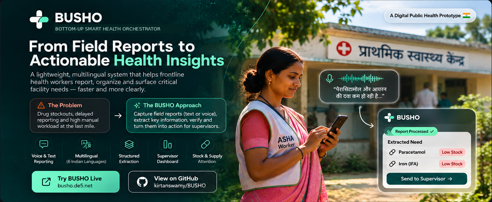

<!-- BUSHO repository landing page. Keep all claims aligned with the working prototype. -->

<div align="center">



<br />

[](https://busho.de5.net)
[](#what-exists-today)
[](#run-locally)
[](#run-locally)
[](#run-locally)
[](https://github.com/kirtanswamy/BUSHO/actions/workflows/ci.yml)
[](LICENSE)

</div>

---

## About BUSHO

**BUSHO (Bottom-Up Smart Health Orchestrator)** is a browser-based public-health workflow prototype that explores how frontline health-worker reports can be structured, verified, and surfaced to supervisors—without automating clinical decisions or procurement.

It focuses on one hand-off: **community → frontline worker → facility / supervisor**.

<table>
  <tr>
    <td width="25%" valign="top">

### ◉ Capture

Report needs via text or voice in local languages.

</td>
    <td width="25%" valign="top">

### ◈ Extract

Convert unstructured reports into structured, editable draft fields.

</td>
    <td width="25%" valign="top">

### ◎ Organize

Keep the original report visible and put human verification first.

</td>
    <td width="25%" valign="top">

### ↗ Act

Highlight sample stock risks and prepare supervisor-reviewed drafts.

</td>
  </tr>
</table>

> **Prototype boundary:** BUSHO uses synthetic sample data, mock rule-based extraction, and browser-local storage. It is not a live health system, does not diagnose, does not place medicine orders, and does not connect to government inventory systems.

## The gap

A health worker may notice a local pattern, a follow-up need, or a medicine running low. But a useful signal can lose time and context as it moves from a field note into registers, calls, spreadsheets, and administrative workflows.

This is not a claim that India has no digital health or supply-chain systems. Public programmes and state systems already exist. BUSHO asks a narrower question:

> Can the first-mile report become easier to structure, verify, and route—while fitting around existing facility and government systems rather than replacing them?

| First-mile challenge | What BUSHO prototypes |
|---|---|
| Notes arrive in inconsistent free-text formats | A structured draft beside the original report |
| Details can be missed or misread | Human correction and confirmation before verification |
| Stock concerns may need escalation | A supervisor-facing attention signal using sample inventory |
| A proposed next step can be mistaken for an order | A reviewable draft; no automatic procurement |

## How it works


1. **Report** — a frontline worker enters a short field update in plain language.
2. **Structure** — the prototype proposes fields using mock, rule-based extraction.
3. **Verify** — the worker inspects, edits, and confirms the proposed record. The original report remains visible.
4. **Review** — a supervisor sees the verified operational record alongside a synthetic stock attention signal.
5. **Prepare** — the supervisor reviews a replenishment draft. **No real order is placed.**

### Safety principles

- A draft is not a fact. A reported trend is not a diagnosis.
- Human confirmation is required before a record is treated as verified.
- Stock signals are operational prompts, not clinical recommendations.
- Replenishment is a draft for review—not an automatic order.
- The demo uses synthetic sample data and browser-local storage. Never enter real patient-identifiable or sensitive health information.

## Why this workflow matters

These sources establish that medicine availability and frontline information workflows are real areas of concern. They do **not** prove that BUSHO has solved them.

<details>
<summary><strong>Chhattisgarh — historical public-facility availability finding</strong></summary>

A study covering **100 public health facilities across 15 districts** and **1,290 prescriptions** in Chhattisgarh reported that **58.28% of prescribed generic medicines included in the state's essential-drug list were available** to patients during the study period (2013–14).

This is a historical, study-specific finding—not a current statewide estimate and not evidence of BUSHO's impact.

- [Study record — PubMed](https://pubmed.ncbi.nlm.nih.gov/29915750/)
- [State Health Resource Centre — free-drug and diagnostics studies](https://www.shsrc.org/StudiesFreeDrugandDiagnostics.html)

</details>

<details>
<summary><strong>India — medicine availability varies across settings</strong></summary>

A 2024 review of 11 studies reported public-sector medicine availability estimates ranging from **17% to 51%** across the included studies. The range reflects different settings and methods; it is not one national estimate.

- [2024 review — PubMed Central](https://pmc.ncbi.nlm.nih.gov/articles/PMC11174260/)

</details>

<details>
<summary><strong>Frontline digital workflows — usability and data burden</strong></summary>

A 2022 qualitative study in *BMJ Open* described frontline workers' experiences with digitised health reporting, including multiple forms and registers, data-entry backlogs, and data-quality challenges.

The lesson is not “add another app.” It is to test whether a workflow reduces friction and duplicate effort in the local context.

- [BMJ Open study — PubMed](https://pubmed.ncbi.nlm.nih.gov/35140145/)

</details>

<details>
<summary><strong>Existing systems — BUSHO is not a replacement</strong></summary>

India and Chhattisgarh have existing health-information and medicine-supply initiatives. Any future BUSHO pilot must map the real workflow and approved interfaces first.

- [16th Common Review Mission report (2024) — NHSRC](https://nhsrcindia.org/sites/default/files/2025-03/16th%20CRM%20Report%20%282024%29_0.pdf)
- [Free Drugs Service Initiative — NHSRC](https://nhsrcindia.org/free-drugs-service-initiative-0)

</details>

## What exists today

| In this prototype | Not implemented / not validated |
|---|---|
| Worker and supervisor demo views | Production authentication or role-based access |
| Mock, rule-based extraction | Production AI inference |
| Editable records and human confirmation | Clinical diagnosis or triage |
| Browser-native voice input, where supported | BUSHO-operated transcription service |
| Synthetic inventory attention logic | Live government / facility inventory feeds |
| Replenishment draft workflow | Real orders or procurement |
| English, Hindi, Tamil, Telugu, Bengali and Marathi interface | Field validation with health workers |
| Browser-local persistence | Shared backend, database, or cross-device sync |
| Automated prototype checks | Measured health outcomes or proven impact |

**Voice privacy:** Voice input uses the browser's speech-recognition service, which may send audio to the browser vendor. BUSHO does not store audio recordings. Manual text entry remains available. Do not speak names, phone numbers, diagnoses, government IDs, or other identifying patient details.

## Run locally

**Requirements:** Node.js 18+ and a modern browser.

```bash
git clone https://github.com/kirtanswamy/BUSHO.git
cd BUSHO
npm install
npm start
```

Open **http://127.0.0.1:4173**.

Run automated checks:

```bash
npm run check
```

## Project map

| Path | Responsibility |
|---|---|
| `index.html` | Application shell and worker / supervisor views |
| `styles-v2.css` | Responsive interface and design system |
| `app-v2.js` | Demo workflow, mock extraction, validation, sample inventory and voice interaction |
| `i18n.js` | Interface translations |
| `server.mjs` | Lightweight local static server |
| `tests/` and `scripts/` | Automated checks and smoke tests |
| `ARCHITECTURE.md` | Data flow, boundaries and proposed evolution |
| `IMPACT_AND_IMPLEMENTATION.md` | Risks, pilot logic and evaluation approach |

## Before a real pilot

BUSHO is a **workflow prototype**, not a deployable healthcare product. A responsible next phase would be:

1. **Validate locally** — interview frontline workers, facility staff and supervisors; map actual paper, phone, HMIS and stock workflows.
2. **Check for duplication** — identify what existing systems already capture and where an approved hand-off is genuinely missing.
3. **Co-design and test** — use synthetic or properly de-identified scenarios first; test on low-end devices and unreliable connectivity.
4. **Build foundations** — secure authentication, role-based permissions, protected backend, audit logs, retention controls and security review.
5. **Validate technology** — evaluate extraction against a labelled dataset, obtain native-speaker translation review, and retain human approval.
6. **Run a supervised pilot** — measure reporting time, completeness, correction rate, duplicate-entry burden, escalation time, stockout duration and worker adoption against a baseline.

Potential pilot targets are hypotheses—not achieved results. No reduction in mortality, disease burden, or stock-outs is claimed.

## What success should mean

A useful pilot should demonstrate that BUSHO helps workers and supervisors do a real task **more accurately or with less friction**, without creating extra reporting burden or unsafe automation.

- Is the report more complete?
- Does verification take less time?
- Are errors caught before escalation?
- Does the right person receive a useful stock signal sooner?
- Does the workflow avoid duplicate entry?
- Do workers choose to keep using it?

If those answers are not supported by field evidence, the project should change—not inflate its impact claims.

## Contributing and support

Contributions are welcome, especially bug reports, accessibility improvements, translation corrections, and documentation fixes. Please read [CONTRIBUTING.md](CONTRIBUTING.md) before opening a pull request. Never submit real patient data in an issue, screenshot, test fixture, or pull request.

- [Report a bug](https://github.com/kirtanswamy/BUSHO/issues/new?template=bug_report.yml)
- [Suggest a translation correction](https://github.com/kirtanswamy/BUSHO/issues/new?template=translation_correction.yml)
- [Report a security vulnerability privately](SECURITY.md)
- [Code of Conduct](CODE_OF_CONDUCT.md)

---

<div align="center">

**Built as a social-impact prototype. Designed around human review. Open to evidence and iteration.**

[**↗ Open BUSHO — busho.de5.net**](https://busho.de5.net)

[Alternate Vercel deployment](https://project1busho.vercel.app/) · [Architecture](ARCHITECTURE.md) · [Impact & implementation plan](IMPACT_AND_IMPLEMENTATION.md)

</div>
